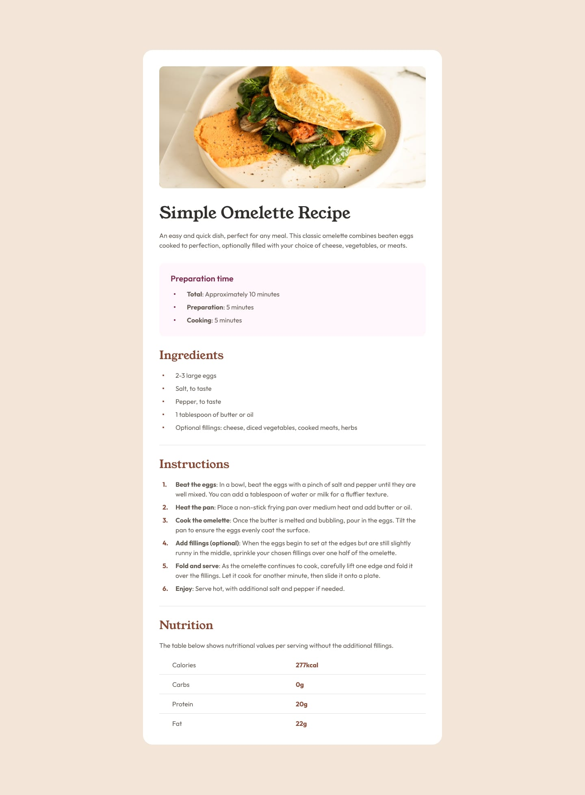

# Frontend Mentor - Recipe page solution

This is a solution to the [Recipe page challenge on Frontend Mentor](https://www.frontendmentor.io/challenges/recipe-page-KiTsR8QQKm). Frontend Mentor challenges help you improve your coding skills by building realistic projects.

## Table of contents

- [Overview](#overview)
  - [The challenge](#the-challenge)
  - [Screenshot](#screenshot)
  - [Links](#links)
- [My process](#my-process)
  - [Built with](#built-with)
  - [What I learned](#what-i-learned)
  - [Useful resources](#useful-resources)
- [Author](#author)

## Overview

### The Challenge

The challenge is to build out this recipe page and get it looking as close to the design as possible.

### Screenshot



### Links

- Solution URL: [Github Repo](https://github.com/Onenne1/frontend-mentor-recipe-page-main)
- Live Site URL: [Github Pages](https://onenne1.github.io/frontend-mentor-recipe-page-main)

## My process

### Built with

- Semantic HTML5 markup
- CSS custom properties
- Flexbox
- CSS Grid
- Mobile-first workflow

### What I learned

CSS Custom Properties

```css
:root {
  --light-color: #fff;
  --black: #000;
  --dark-color: #333;
  --stone-100: #f3e6d8;
  --stone-150: #e4ded8;
  --stone-600: #5f574e;
  --stone-900: #302d2c;
  --brown-800: #854632;
  --rose-50: #fff5fa;
  --rose-800: #7b284f;
  --h1-font-size: 2.25rem;
  --h2-font-size: 1.5rem;
  --h3-font-size: 1.75rem;
  --table-font-size: 1.1rem;
  --table-border: 1px solid var(--stone-150);
}
```

### Useful resources

- [ChatGPT](https://www.chatgpt.com)
- [W3schools](https://www.w3schools.com)

## Author

- Frontend Mentor - [Onenne1](https://www.frontendmentor.io/profile/onenne1)
<<<<<<< HEAD
=======

>>>>>>> 028fb5d2256c7427254310f93548cf7349a3e258